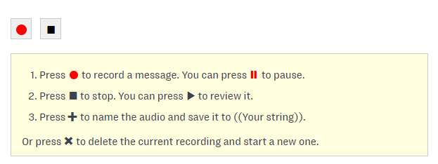

# RecordAudioWidget
Created by Lauren Anderson, updated by Jacob Thomsen, 2023.

Built to run on Mendix version 9.18.2

## Features
- This widget can record audio using HTML MediaRecorder, 
- Play the audio back to you
- Download the .weba file of the audio 
- *And pass the audio into your Mendix application as a System.FileDocument entity*

## How to Modify the Widget
Follow these step to modify the code of this widget and build your modifications to be usable:
1. Clone this repository
2. Navigate to the repository from the command-line
3. Run `npm install` to download all the required node modules
4. Navigate to `/src` and edit files as you need
    - `RecordAudioWidget.xml` is where you can edit the pop-ip widget menu in Mendix Studio
    - `/components/RecordAudio.tsx` is where you can edit the rendering and the primary code that runs the widget
5. To build the app, return to your command-line focused on this project's home directory, and run `npm run build`
6. This will build the widget .mpk file to the `/dist/1.0.0` directory
   - *If you would like to change where the build saves the .mpk file, edit the "project path" on line 9 of `package.json`
to your desired folder (i.e. your app widgets directory)* 

## Setting Up
### To add the widget to your project
1. Download this repository
2. Move the file `byu.RecordAudioWidget.mpk` from `/dist/1.0.0.` to your Mendix application's `widgets` folder
3. In Studio Pro, press F4 or navigate to App -> Synchronize App Directory, and click this option.

### Making the widget functional
To use the widget, there are a few items you will need complete in your project.
1. In your Domain Model, add a first entity, non-persistable, with these fields:  
Url : String,  
Filename : String,  
Title : String,   
isUrlDisplayed : Boolean (Default: false)

This entity is used to generate audio blob urls, which are how MediaRecorder stores the audio within the browser.

2. Add a persistable entity that is a generalization of System.FileDocument, with one attribute, Title : String

3. Create a Microflow, named however you please, that returns and creates an instance of the first entity.

4. On the page where you would like to have the widget, add a DataView which calls the microflow you just created. 
5. In the DataView, below the Text Box, place the widget.

6. Create a Microflow that takes an instance of the persistable entity as a paramter and then handles the entity-
which now contains the audio file- as you please.

### Widget Settings
These are the required settings of the widget you will need to set in order to use the widget.
- Set the Data source of the widget to be the Url string of the given entity.*

#### Instructions
- You can select whether you would like to display the instructions section of the widget.
- Enter a descriptive string of where the audio files will be saved.

#### File Management
- Enter the title of the Microflow you made to handle the audio file when the save recording button is selected.*
- Enter the title of the persistable entity you created to store the audio file.*

(* required)

## User Interaction
Once you have the widget set up, it should look like this on the web page.
As noted above, you can customize the end of step 3 with your own description. 
Or you can hide the instructions panel entirely.

## Demo project
[link to sandbox]

## Issues, suggestions and feature requests
[Issues Page](https://github.com/laurenra7/recordAudioWidget/issues)

## Development and contribution
[specify contribute]
